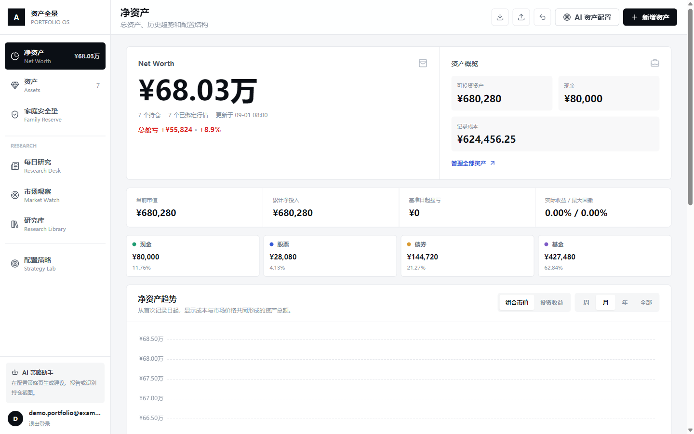
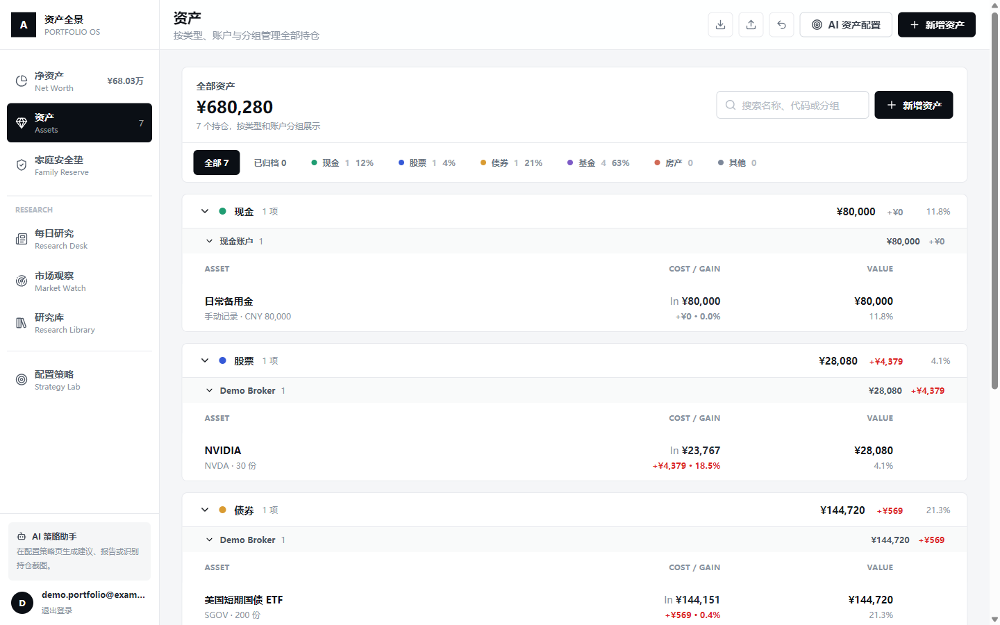

# Portfolio OS：个人资产与投研工作台

一个面向个人投资者的本地优先资产管理系统。它把多币种持仓、交易账本、配置暴露、家庭安全垫和研究工作流放在同一个网页中，同时把 API 凭据与个人数据留在使用者自己的环境和数据库里。

> 仓库不包含作者的账户、持仓、交易、家庭资产、API Key 或数据库。下方截图与 `examples/demo-portfolio.json` 均为虚构演示数据。





## 主要能力

- 多币种资产账本：股票、基金、债券、现金、黄金、房产及其他资产。
- 交易与现金联动：买入、卖出、入金、取现、调仓、换汇和账户间转账。
- 组合配置视图：资产大类、核心暴露和地区分布，可追溯到实际持仓。
- 收益核算：区分外部资金流与内部交易，保存交易日汇率和人民币历史成本。
- 行情路由：AKShare 与 Yahoo Finance 按市场选择并降级。
- 导入导出：使用 `portfolio_backup_v3` JSON 保存持仓、流水、币种、汇率与暴露映射。
- 家庭安全垫：独立记录定存、现金基金、到期日和资金用途，不混入个人组合风险比例。
- AI 策略助手：可选接入 OpenAI 兼容 API，支持组合问答、截图识别和 HTML 报告。
- 投研工作区：每日研究、市场观察、宏观、行业、量化实验和研究资料库。

## 技术栈

- Frontend: React 18, TypeScript, Vite, Tailwind CSS, Zustand, ECharts
- Backend: FastAPI, SQLAlchemy 2, Postgres 16
- Auth: Argon2 password hash and server-side session cookie
- Runtime: Docker Compose, Nginx

## 五分钟启动

### 1. 获取代码并配置环境

```bash
git clone https://github.com/Snowball-labbot/-.git portfolio-os
cd portfolio-os
cp .env.example .env
```

Windows PowerShell 可使用：

```powershell
Copy-Item .env.example .env
```

至少修改 `.env` 中的 `POSTGRES_PASSWORD` 和 `SESSION_SECRET`。AI 与第三方数据 Key 都是可选项。

### 2. 启动整套服务

```bash
docker compose up --build -d
```

该命令会启动 Postgres、FastAPI、投研数据 worker 和前端。默认访问地址：

- Web: `http://localhost:5173`
- API docs: `http://localhost:8000/docs`

### 3. 本地注册并导入资产

打开网页后直接使用邮箱和密码注册本地账号，不需要邀请码。登录后可以导入自己的 `portfolio_backup_v3` JSON。首次体验可导入仓库中的：

```text
examples/demo-portfolio.json
```

这份文件只包含虚构资产。导入前会显示重复项预览，导入后可按批次撤销。

默认配置 `ALLOW_OPEN_REGISTRATION=true` 适合本地使用。若部署到公网，请改为 `false`，再由管理员创建邀请码；管理员账号可通过以下命令创建或重置：

```bash
docker compose exec backend python -m backend.scripts.create_admin \
  --email you@example.com \
  --password your-strong-password
```

## 不使用 Docker 的开发方式

```bash
npm install
python -m pip install -r backend/requirements.txt
uvicorn backend.main:app --reload --port 8000
npm run dev
```

本地开发需要自行准备 Postgres，并在 `.env` 中设置 `DATABASE_URL`。Vite 会把 `/api` 代理到 `http://localhost:8000`。

## API 与私有数据隔离

项目遵循三条边界：

1. **代码进入 Git**：前后端源码、数据库结构、测试、环境变量模板和虚构演示数据。
2. **凭据只进 `.env`**：AI、Alpha Vantage、数据库密码、Session Secret 和 SEC User-Agent。
3. **个人数据只进 Postgres 或私人备份**：账号、持仓、流水、研究简报和家庭安全垫。

`.env`、数据库文件、Excel、CSV、资产导出、生成的研究数据包和私有种子脚本均已从 Git 与 Docker 构建上下文排除。更完整的发布检查见 [SECURITY.md](SECURITY.md)。

可选 AI 配置：

```env
AI_API_KEY=your-api-key
AI_BASE_URL=https://api.openai.com/v1
AI_MODEL=your-chat-model
AI_VISION_MODEL=your-vision-model
```

可选投研数据配置：

```env
ALPHA_VANTAGE_API_KEY=your-alpha-vantage-key
RESEARCH_USER_AGENT=PortfolioResearch/1.0 your-email@example.com
```

不要把真实值写回 `.env.example`，也不要把资产备份上传到公开 Issue。

## 资产导入格式

推荐使用 JSON 而不是 CSV。`portfolio_backup_v3` 可以完整描述：

- 资产类型、账户分组、市场、代码和币种
- 持仓数量、成本、现价和人民币汇率
- 交易流水、费用、资金性质与已实现盈亏
- 核心暴露映射和归档状态

网页右上角提供导出、导入、重复检测和撤销最近导入批次。最稳妥的迁移方式是先在旧实例导出，再在新实例预览并导入。

## 数据更新与研究工作流

- 行情刷新可由后端定时任务执行，也可在资产详情页手动触发。
- 宏观日历、财报、SEC 文件和新闻由 `research-worker` 按滚动时间窗同步。
- 自动化只采集事实和元数据，不自动替用户形成投资结论。
- Codex 每日简报可通过脚本整理上下文并发布到研究库；生成内容仍应由用户复核。

## 常用检查

```bash
npm run check
npm run lint
npm run test
npm run build
python -m compileall backend
python -m unittest discover -s backend/tests -v
```

## 安全与免责声明

- 本项目默认面向本地单用户或可信家庭网络，不等同于完成互联网生产加固。
- 公网部署前必须更换全部默认密码、启用 HTTPS、限制 Postgres 网络访问并复核 CORS 与备份策略。
- 行情、汇率、基金暴露和研究资料可能延迟或不完整，请以券商和官方来源为准。
- AI 输出仅用于整理与分析，不构成投资建议。

## License

[MIT](LICENSE)
